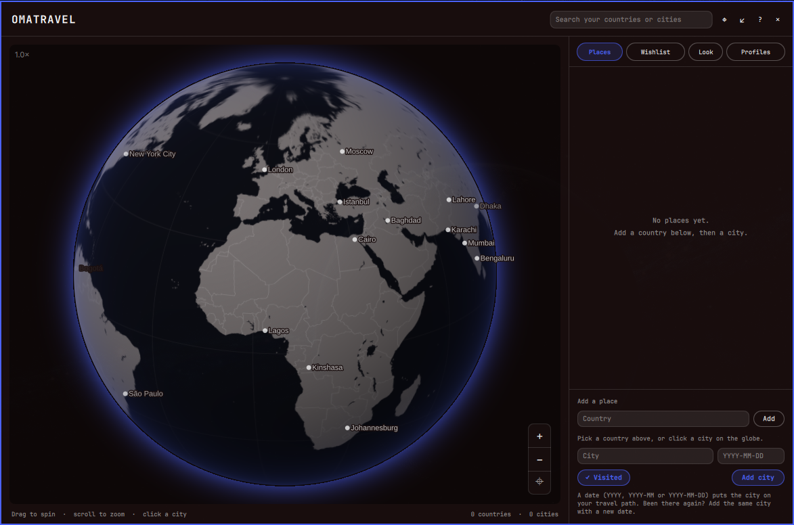

# Omatravel

An [Omarchy](https://omarchy.org) shell bar widget that keeps a spinning globe of everywhere you have been, and everywhere you want to go.



Click the globe icon in the bar to open the atlas: drag to spin the globe, zoom in until city labels appear, log countries and cities (with as many dated visits as you like), and watch your travel path draw itself in order. Pop the whole panel out into its own window if you want it on a second monitor.

## Features

- **Interactive globe**: a GPU-shaded orthographic globe. Drag or flick to spin, scroll or use **+ / − / ⌖** to zoom (up to 40×) and recentre. Land, borders and graticule are coloured by your theme.
- **City labels as you zoom**: four population bands load on demand, from cities over 500,000 people out to every place over 1,000. Click a city on the globe to prefill the add form.
- **Places**: log countries and the cities you visited. A city can carry several dated visits (`2019`, `2019-05` or `2019-05-02`); repeat visits show as `Barcelona ×5`.
- **Travel path**: dated visits are joined by great-circle arcs in chronological order, so a city visited twice is returned to.
- **Wishlist**: pin places you want to visit in a second colour.
- **Profiles**: keep separate maps (for example "me" and "family"). The default profile cannot be deleted.
- **Search**: filter your countries and cities from the header.
- **Flags**: optional country flag emoji in the list and tooltip.
- **Pop out**: detach the panel into a normal window; click the bar icon to dock it back. Both variants always look identical.
- **Themes**: **Follow Omarchy** repaints the whole panel and globe with your live Omarchy theme and updates the moment you switch it, or pick one of ten fixed palettes.
- **Bar button**: icon plus `countries · cities`, with a tooltip listing your countries.
- **Offline**: all map and city data ships inside the plugin. No network access.

## Install

```
omarchy plugin add https://github.com/qempexe/omarchy-omatravel.git --enable --yes
```

Or by hand: copy this directory to `~/.config/omarchy/plugins/io.github.qempexe.omatravel/` (the folder name must match the plugin id), then:

```
omarchy-shell shell rescanPlugins
omarchy plugin enable io.github.qempexe.omatravel
```

Add the widget to your bar layout in `~/.config/omarchy/shell.json`, under `bar` → `layout` → the section you want (`left`, `center` or `right`):

```
{ "id": "io.github.qempexe.omatravel" }
```

Then restart the shell:

```
omarchy restart shell
```

### See it work in 1 minute

Click the globe icon, type `Spain` in the **Country** box and press **Add**, then type `Barcelona`, a date such as `2024-06`, and press **Add city**. The globe pins it. Add a second dated city and an arc appears between them.

## Usage

| Action                          | How                                                              |
| ------------------------------- | ---------------------------------------------------------------- |
| Open / close the panel          | Left-click the globe icon                                        |
| Spin the globe                  | Drag or flick                                                    |
| Zoom                            | Scroll wheel, or **+** / **−**                                   |
| Recentre                        | **⌖**                                                            |
| Prefill the add form            | Click a city on the globe                                        |
| Select a country                | Click its row in **Places**                                      |
| Fly to a city                   | Click its chip                                                   |
| Log another visit               | Add the same city again with a new date                          |
| Remove a country, city or visit | **✕** next to it                                                 |
| Pop out / dock back             | **↗** in the header; while popped out, click the bar icon        |
| Controls cheat-sheet            | **?** in the header                                              |
| Close                           | `Esc` or **✕**                                                   |

The sidebar has four tabs: **Places**, **Wishlist**, **Look** and **Profiles**. The "Add a place" form is docked at the bottom; flip its switch between **✓ Visited** and **♡ Wishlist** to choose where a city goes.

## Settings

Open the **Look** tab. Everything applies instantly and is saved to `~/.local/share/omatravel/travel-data.json` (or `$XDG_DATA_HOME/omatravel/`). You can edit that file by hand; it is watched and re-read when it changes, and invalid values are ignored.

### Look

| Setting              | File key                | Default | Meaning                                                              |
| -------------------- | ----------------------- | ------- | -------------------------------------------------------------------- |
| Theme                | `theme`                 | `auto`  | `auto` (Follow Omarchy) or one of the named themes below             |
| Bar icon             | `display.icon`          | 🌍      | Up to 8 characters shown in the bar                                  |
| Show flags           | `display.showFlags`     | true    | Flag emoji in the list and tooltip                                   |
| Travel path on globe | `display.showPath`      | true    | Draw arcs between dated visits                                       |
| City labels on globe | `display.showPlaces`    | true    | Label cities on the globe as you zoom                                |

### File-only

| File key                      | Default | Meaning                                    |
| ----------------------------- | ------- | ------------------------------------------ |
| `display.maxTooltipCountries` | 8       | Countries listed in the bar tooltip        |
| `display.maxTooltipCities`    | 10      | Cities listed per country in the tooltip   |
| `activeProfile`               | default | Which profile is shown                     |

Cities are looked up by name in the bundled atlas. For a place it does not know, add `"lat"` and `"lng"` to its entry under `city_meta` and it will be pinned there.

### Themes

`Follow Omarchy` plus: `catppuccin`, `dracula`, `everforest`, `gruvbox`, `kanagawa`, `mono`, `nord`, `omarchy`, `rose-pine`, `tokyo-night`.

## How it works

- **Following Omarchy**: the plugin reads the active theme's `colors.toml` (or the per-app files older Omarchy themes ship: `alacritty.toml`, `kitty.conf`, `waybar.css`, `btop.theme`, `mako.ini`, `hyprland.conf`) for background, text and accent. If your install has no "current theme" marker, it scans the themes in `~/.config/omarchy/themes` and picks the one that matches the colour your shell bar is using. It re-reads whenever that colour or `theme.name` changes, with a slow poll as a backstop. If nothing can be read it falls back to the shell's own colours.
- **One palette for both variants**: the bar popup and the detached window draw the same opaque background, text and accent, so they cannot drift apart.
- **The globe** is a fragment shader (`shaders/globe.frag`) sampling a land / border / graticule mask (`assets/earth.png`) and tinting it with the theme. Pins, arcs and labels are drawn on a canvas on top using the same projection maths (`GlobeProjection.js`).
- **City data** is split into four zoom bands (`z0`–`z3`, by population) plus a name → coordinates index. Bands are only read from disk when you zoom far enough to need them.
- **Saving** goes to a file outside the plugin folder, so Quickshell's hot-reload of the plugin directory never restarts your bar when you add a city.
- Text from your data and from the filesystem is always drawn as plain text, never rich text.

## Data and privacy

- Your places live in `~/.local/share/omatravel/travel-data.json` and nothing else is stored. An older save inside the plugin folder (`data/travel-data.json`) is copied across once.
- The only external process it runs is `sh`, for `mkdir` and `cp` (creating the data folder and the one-off migration) and `cat`, `ls` and `find` (reading Omarchy's theme files under `~/.config/omarchy` and `~/.local/share/omarchy`). **No network access, no telemetry.**
- Plugins run unsandboxed in the shell process. This one reads and writes only the files described here.

## Limitations

- City lookup knows places of 1,000 people or more. A city it cannot find is still saved and listed, but has no pin until you give it coordinates (see Settings).
- The globe needs a working Qt RHI shader backend. If it renders blank, rebuild the shaders with `tools/build-shaders.sh` (needs `qt6-shadertools`).
- With **Follow Omarchy**, if the shell tints or dims its own background, matching an installed theme by colour may fail and the shell's colours are used instead. The hint under the theme buttons says what it found.

## Files

| File                                          | Purpose                                                       |
| --------------------------------------------- | ------------------------------------------------------------- |
| `manifest.json`                               | Omarchy plugin manifest                                       |
| `BarWidget.qml`                               | Bar icon, tooltip and panel host                              |
| `Panel.qml`                                   | The popup panel: header, sidebar tabs, add form, theming      |
| `TravelModel.qml`                             | State, persistence, data loading, live Omarchy theme          |
| `GlobeView.qml`                               | The globe: shader, pins, arcs, labels, zoom controls          |
| `Model.js`                                    | Pure logic: store, countries, dates, theme parsing            |
| `GlobeProjection.js`                          | Orthographic projection and great-circle maths                |
| `DetachedWindow.qml`                          | The pop-out window                                            |
| `FlatButton.qml`, `FieldBox.qml`, `SectionLabel.qml` | Small themed UI pieces                                 |
| `shaders/`                                    | `globe.vert` / `globe.frag` and their compiled `.qsb`         |
| `assets/earth.png`                            | Land / border / graticule mask                                |
| `data/layers/`                                | `z0`–`z3.json` city bands and `index.json` lookup             |
| `tools/`                                      | Build scripts for the shaders, texture and city data          |
| `preview.png`                                 | Screenshot used in this README and the marketplace            |

## Development

Plugin files under `~/.config/omarchy/plugins/` are watched, but restart the shell to be sure you are running the latest code:

```
omarchy restart shell
```

To check the manifest:

```
omarchy plugin validate .
```

To lint the QML:

```
qmllint -I "$OMARCHY_PATH/shell" BarWidget.qml Panel.qml TravelModel.qml GlobeView.qml
```

The files in `assets/`, `shaders/*.qsb` and `data/layers/` are generated and committed, so installing needs none of this. To regenerate them (these scripts are the only part of the project that touch the network, and they are never run by the plugin):

```
tools/build-shaders.sh     # needs qt6-shadertools (qsb)
tools/build-texture.py     # needs python3 + pillow; downloads Natural Earth
tools/build-layers.py      # downloads GeoNames cities1000
```

## Updating

```
omarchy plugin update io.github.qempexe.omatravel
omarchy restart shell
```

The first command pulls the latest version. The second is required because the shell does not reliably reload changed QML on its own.

## Uninstall

```
omarchy plugin remove io.github.qempexe.omatravel
```

If this does not edit `shell.json`: remove the `{ "id": "io.github.qempexe.omatravel" }` entry from your bar layout by hand. Then restart the shell:

```
omarchy restart shell
```

To also delete your saved places:

```
rm -rf ~/.local/share/omatravel
```

This is optional. Leave it if you might reinstall and want your map back.

## License

[MIT](LICENSE)

### Third-party data

The code is MIT. The bundled data is derived from these sources, which keep their own terms:

- **City names and coordinates** (`data/layers/`): derived from [GeoNames](https://www.geonames.org) `cities1000`, licensed under [Creative Commons Attribution 4.0](https://creativecommons.org/licenses/by/4.0/). Changes: filtered by population into zoom bands, reduced to name, country code, population and rounded coordinates, and indexed by folded name. Attribution to GeoNames is required if you reuse this data.
- **Land, borders and lakes** (`assets/earth.png`): rendered from [Natural Earth](https://www.naturalearthdata.com) 1:50m vector data, which is in the public domain.
- **Flags** are emoji drawn by your system font; nothing is bundled.

Omatravel is an independent community plugin. It is not affiliated with or endorsed by Omarchy or its authors.
